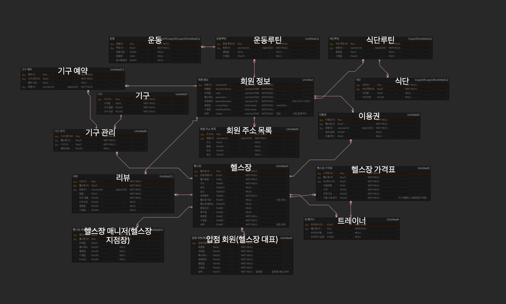
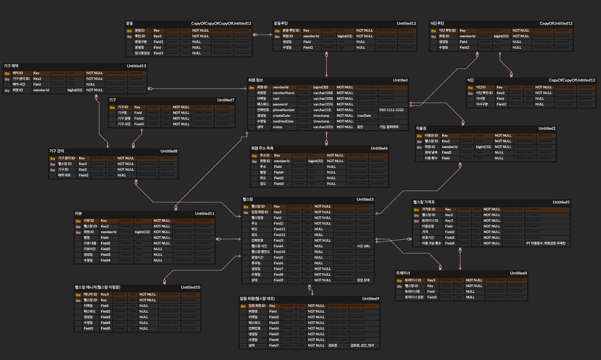
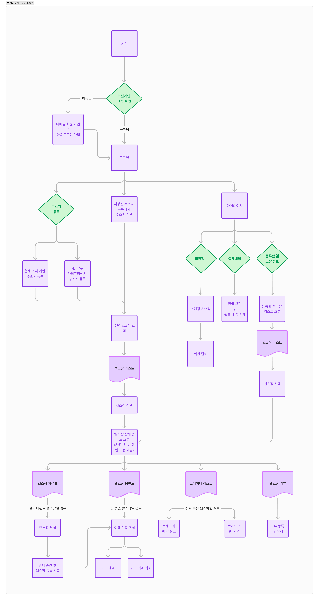
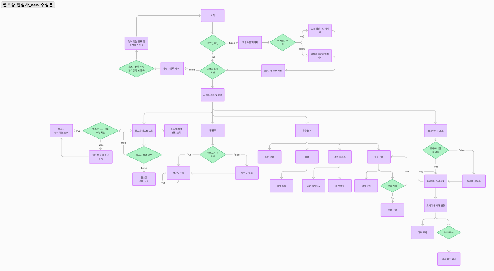
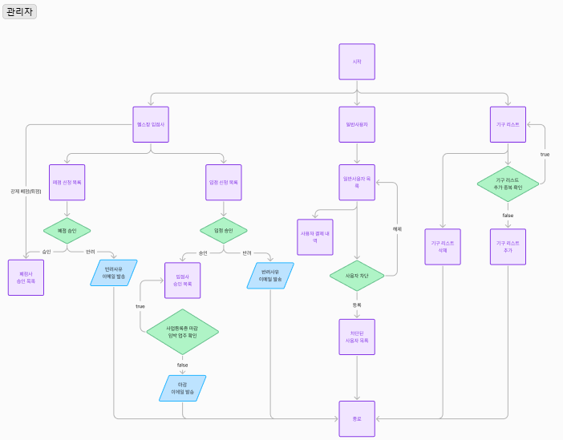

# 헬스
## 프로젝트 목표
- 헬스장에 직접 가지 않고도 온라인으로 헬스장의 정보를 알아봄으로 접근성을 쉽게 만듭니다. 
- 온라인상에 PT권과 이용권이 명시되어 있는 곳이 많이 없어서 사용자가 쉽게 확인 가능하게 만듭니다.

## 추후 계획
- 식단 관리 & 운동 관리 기능을 추가하여 헬스 기구 예약뿐만 아니라 다른 다양한 서비스도 이용할 수 있게 만든다.
- 글로벌 사용자를 위해 국제화 기능을 제공한다.
  

## 팀원
 - 1차 : 송해덕(팀장), 이강민
 - 2차 : 송해덕(팀장), 임건우, 박소은, 김영래

## 기능 명세서
[기능 명세서 - 노션](https://sincere-nova-ec6.notion.site/28c63946543741469dff21aebadc22d0?pvs=4)

### 수정 내역
   - 식단 관련 모두 삭제
   - 전체적인 명세서 새로 작성
   - 속성, 상세 기능, 목적 및 설명, API Path 추가

## ERD

### 수정 ERD

## 데이터 흐름도
### 일반사용자

### 헬스장 입점자

### 관리자

## 시스템 아키텍처

## 기술 및 스택

### 백엔드
- Spring Boot
- Spring Data JPA

### 프론트엔드 
- node.js
- javascript
- react

### 데이터베이스
- MySQL

### 외부 API
- 구글 맵 api
- 네이버 OAuth2.0
- 구글 OAuth2.0
- 카카오 OAuth2.0

### Library
- Konva.js

