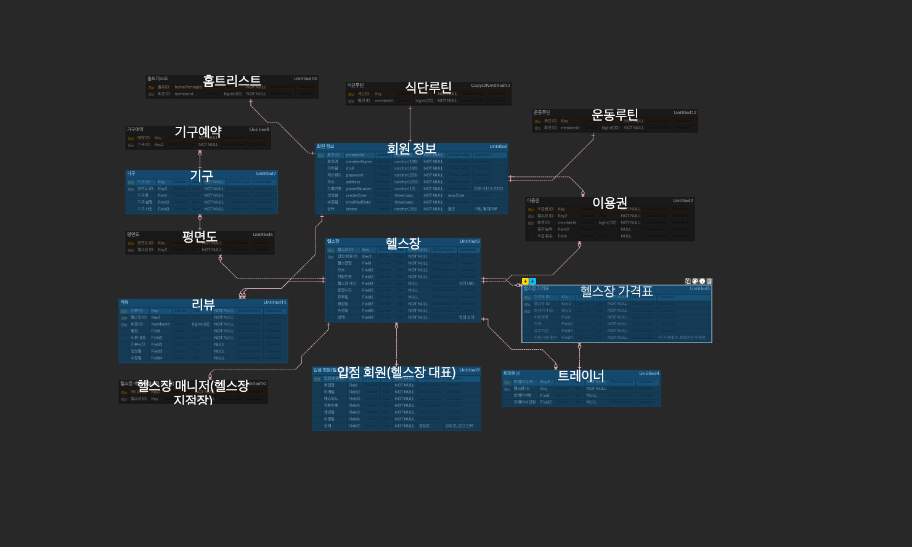

# 헬스
## 프로젝트 목표
- 헬스장에 직접 가지 않고도 온라인으로 헬스장의 정보를 알아봄으로 접근성을 쉽게 만듭니다. 
- 헬스장 고객에게 홈트레이닝과 식단 관리, 운동 스케줄 관리를 제공합니다.

## 팀원
1차 : 송해덕(팀장), 이강민
2차 :

## 기능 명세서
기능 명세서 
- [노션](https://www.notion.so/native/4-f31cac450ed14448a1f58802cb9fef5d?pvs=4&deepLinkOpenNewTab=true)

ERD
